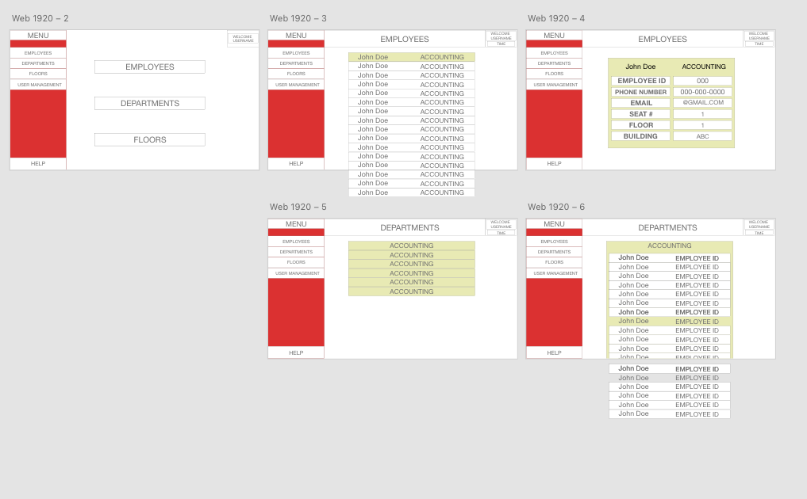
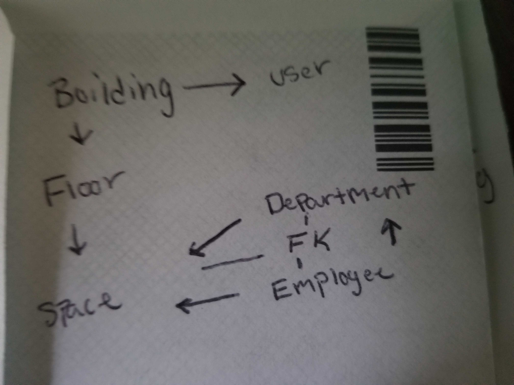
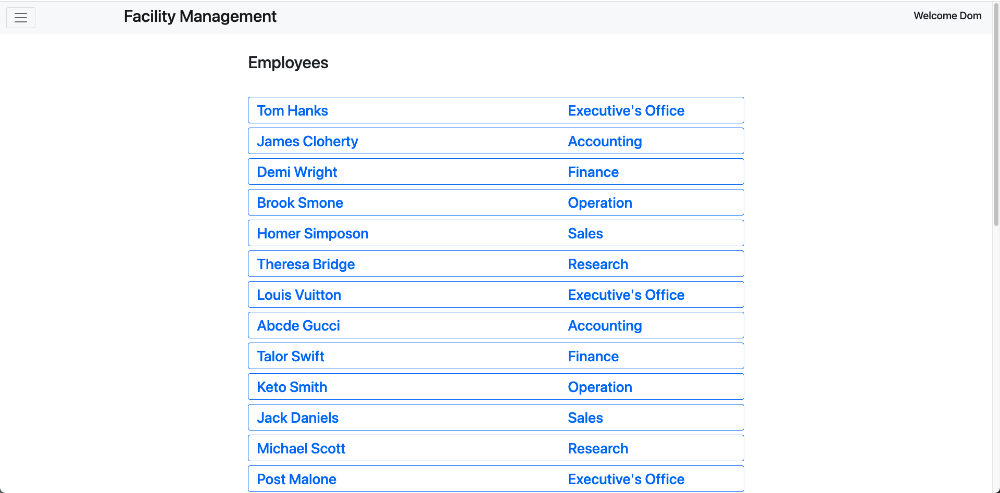
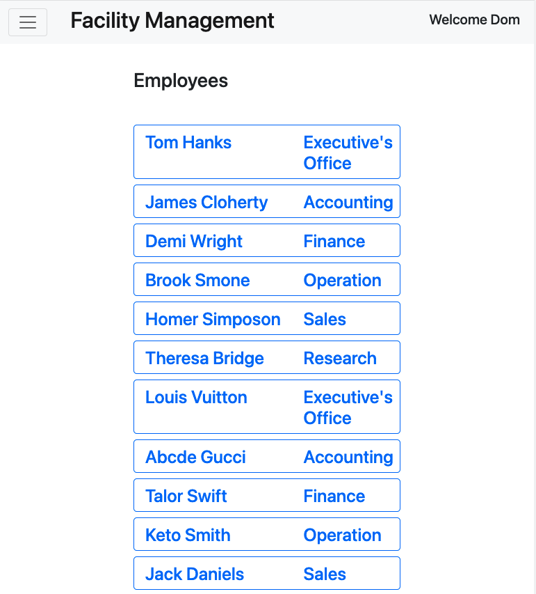

# Facility Management System

## <u>Project Description</u>
As companies evolve and grow, so does their team and office space. 
During a businesses "transition period", our application allows facility management and company logistics to view their employees in different departments, floors, and office space, and see which area needs to be filled.

(**DISCLAIMER:** Our app was made for the purpose of users already being created from the backend server) To test the application, use:
- Email: test@test.org
- Password: testtest

[Click here to check out our app!](https://dn-fac-mgmt.herokuapp.com/login)

**AUDIENCE**:
Facility Managers

**PROBLEM**:
Facility managers strugle to view the overall work space and the number of employees in their respective departments, floors and office space.
During a "transition period" it is difficult to accomodate new employees and support to certain departments.

**PRODUCT SOLUTION**:
An application that allows managers to visually comprehend where their employees are stationed. 

**MVP FEATURES**:
* Login interface & Logout
* Creating users (facility managers) with a secure password
    - Edit and saving users information
    - Deleting users if needed (if you're logged in as the current user)
* Viewing list of employees, departments, and buildings/floors
    - View and navigate employees between the chosen criteria
* Edit and saving employee's personal information

**FUTURE DEVELOPMENT**:
* Delete employees directly through interface
* Adding employees, departments, and buildings/floors directly through interface
* Change employee's placement of seat number, department and building/floor directly through interface
* Employees being in multiple deparments
* Real time facility management
    - Example: 7/50 cubicles on Floor 3 in Building A is available

## <u>Installation Guide</u>
1. Download `Node.js` on your local machine.
2. Clone this repo to your local machine.
3. Run in VSCode and open an integrated terminal.
4. Run `npm install` to load any dependencies (see `package.json` file for more detail).
5. Create a `.env` file and paste these lines of code changing `password` to your MySQL's root user password
```
DB_NAME=facility_db
DB_PASSWORD=password
DB_USER=root
```
6. Initial database login to the MySQL shell using `mysql -u root -p`.
7. Run the schema file with `source db/schema.sql`.
8. Run the seed database provided using `npm run seed`.

## <u>Usage</u>
After proper installation (see above), run `npm start` in the command line within the integrated terminal to access the back end data.

## <u>User Story</u>
```md
AS A facility manager at a company during their 'transition period'
I WANT to be aware of which location my employees are
SO THAT I can accurately assess employees, departments, office space, and floor plans.
```

## <u>Thought Process</u>
```md
GIVEN I am registered facility manager, 
WHEN I login through the user interface,
THEN I am directed to a homepage where I see: EMPLOYEES, DEPARTMENTS, AND FLOORS.
WHEN I click the side menu navigation bar,
THEN I am presented with the following options: HOME, EMPLOYEES, DEPARTMENTS, FLOORS, USER MANAGEMENT, AND LOGOUT.
WHEN I click on the HOME option in the nav bar,
THEN I am sent back to the homepage.
WHEN I click EMPLOYEES from the homepage or the nav bar,
THEN I am presented with a list of all EMPLOYEES and their corresponding DEPARTMENTS. 
WHEN I click one of the EMPLOYEES from the EMPLOYEE list,
THEN I am presented with the EMPLOYEE'S: first and last name, department name, employee ID, phone number, email, seat number, floor number, and building.
WHEN I click DEPARTMENTS from the homepage or nav bar,
THEN I am presented with a list of DEPARTMENTS. 
WHEN I click one of the DEPARTMENTS in the DEPARTMENTS list,
THEN I am presented with the list of EMPLOYEES with their corresponding EMPLOYEE ID.
WHEN I click an EMPLOYEE from the DEPARTMENT list,
THEN I am able to view the EMPLOYEES: first and last name, department name, employee ID, phone number, email, seat number, floor number, and building.
WHEN I click the EDIT button in the upper right corner,
THEN I am able to EDIT the EMPLOYEE'S: first and last name, phone number, and email.
WHEN I click UPDATE at the bottom
THEN the EMPLOYEE'S information will be updated.
WHEN I click FLOORS from the homepage or nav bar,
THEN I am presented with the list of FLOORS and their corresponding BUIlDING name.
WHEN I click on a BUILDING with it's corresponding FLOOR number,
THEN and I am presented with the EMPLOYEES and their corresponding DEPARTMENTS on that FLOOR BUILDING.
WHEN I click an EMPLOYEE from the list,
THEN I am able to view the EMPLOYEES: first and last name, department name, employee ID, phone number, email, seat number, floor number, and building.
WHEN I click USER MANAGEMENT from the nav bar,
THEN I am presented with list of facility managers and with the option to CREATE NEW FACILITY MANAGER.
WHEN I click the CREATE NEW FACILITY MANAGER button,
THEN I am redirected to a new page consisting of the user typing in their: first and last name, email, phone number, and password (minimum of 8 characters).
WHEN the user enters their first and last name, email, phone number, and password (minimum of 8 characters),
THEN the user will click a create button at the bottom of the page and a new user will be created to log in later.
WHEN I click on a facility manager,
THEN I am presented with the managers: first and last name, facility manager ID, email, and phone number. (If I am the current user, I have the ability to edit my manager details and/or delete my account via and EDIT and DELETE button)
WHEN I click the EDIT button, 
THEN I am presented with a inputs to EDIT my: first and last name, email, phone number, a password (minimum 8 characters), and to retype my password for verification purposes.
WHEN I click the DELETE button,
THEN I am able to DELETE my account from the application, and will be logged out.
WHEN I click LOGOUT,
THEN I am logged out.
```

## <u>Wireframe and Images</u>






## <u>Technologie Used</u>
* Handlebars
* Javascript 
* Node.js
* Express.js
* MySQL
* Insomia Core
* Heroku
* Bootstrap
* Sequelize
* Moment
* [Handlebars-dateformat](https://www.npmjs.com/package/handlebars-dateformat) (3rd Party Library)
